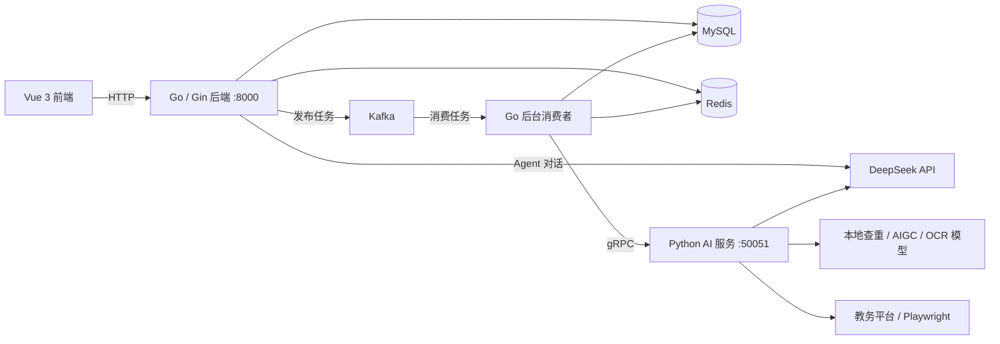

# LLM_TEACH_ASSISTANT

智能教学助理，支持项目作业批改、试卷主观题批改、学术诚信分析和对话式成绩查询。

当前版本由 **Go 业务后端 + Python AI 计算服务 + Vue 3 前端**组成。Go 负责 HTTP 接口、认证、数据管理、Agent 工具调用和异步任务调度；Python 通过 gRPC 提供 OCR、查重、AIGC 检测、评分和教务平台自动化抓取能力。

## 主要功能

- 作业管理：按课程、班级和作业名称创建任务，配置题目要求及 JSON 评分标准。
- 批量作业批改：上传学生作业 ZIP，解析代码和文档，完成查重、AIGC 检测、代码与文档匹配分析及评分。
- 成绩池化：批改后另起后台任务，调用大模型调整整批成绩，并将调整说明附加到评语中。
- 试卷批改：配置题目、标准答案、评分标准和满分，上传学生答卷图片，生成逐题评分和整卷报告。
- 教师复核：保存人工评分、评语和复核标记，支持导出 Excel。
- AI 教学助手：通过自然语言查询学生成绩、触发本地作业批改，或创建教务平台作业下载任务。
- 会话与技能管理：保存聊天历史，配置内置技能的启用状态、描述、参数 Schema 和可用角色。

## 系统架构



MySQL 保存业务数据、聊天消息、异步任务和技能定义；Redis 保存业务缓存、任务状态、任务锁和最近的聊天消息。聊天记忆默认保留最近 20 条消息，Redis 有效期为 24 小时，消息异步持久化到 MySQL。

### 任务处理流程

**作业批改**：上传 ZIP -> 创建任务并返回 HTTP 202 和 `job_id` -> Kafka 消费 -> Go 拆包、解析和合并学生内容 -> Python 全班查重 -> 每位学生的 AIGC 检测、匹配分析和评分 -> 保存提交记录 -> 启动成绩池化。

**试卷批改**：上传图片 -> Kafka 消费 -> OCR 和题号识别 -> 按图片顺序合并全卷文本 -> 将全卷文本用于逐题评分 -> 汇总总分和评语 -> 保存答卷报告。

**教务平台抓取**：Agent 创建抓取任务 -> RPA 消费者调用 Python Playwright -> 下载附件 -> 按课程、班级和作业名称匹配或创建作业 -> 创建独立批改任务并投递 Kafka。抓取任务完成表示下载和投递完成，批改结果由后续任务生成。

Agent 的 `trigger_async_pipeline` 技能直接通过 Go goroutine 调用本地批改流水线；网页上传和教务抓取任务通过 Kafka 调度。

## 技术栈

| 层级 | 技术 |
| --- | --- |
| Go 后端 | Gin、GORM、MySQL、JWT、bcrypt、go-redis、Sarama、gRPC、Excelize |
| Python AI 服务 | grpcio、PyTorch、Transformers、PaddleOCR、scikit-learn、DeepSeek API |
| 自动化抓取 | Playwright、Chromium、OpenCV |
| 前端 | Vue 3、Vite、Vue Router、Tailwind CSS、Axios、marked、DOMPurify |
| 基础服务 | MySQL、Redis、Kafka |

查重使用文本和代码嵌入模型进行相似度初筛，再由 DeepSeek 分析可疑内容；AIGC 检测分别分析文字报告和代码。当前业务数据库由 Go 的 GORM 模型管理。

## 项目结构

```text
LLM_TEACH_ASSISTANT/
├── backend-go/
│   ├── main.go                  # 启动入口、依赖初始化、HTTP 路由
│   ├── go.mod                   # Go 依赖及工具链版本
│   ├── internal/
│   │   ├── agent/               # Agent、内置技能、会话记忆
│   │   ├── auth/                # JWT 和密码处理
│   │   ├── middleware/          # 认证与角色访问控制
│   │   ├── handlers/            # HTTP 业务接口
│   │   ├── models/              # GORM 数据模型
│   │   ├── schemas/             # 业务请求及响应结构
│   │   ├── database/            # MySQL、Redis 和缓存一致性辅助逻辑
│   │   ├── cache/               # 业务缓存和任务状态缓存
│   │   ├── mq/                  # Kafka 生产者、批改与 RPA 消费者
│   │   ├── grpcclient/          # Python 服务客户端
│   │   └── tools/               # 文件解析、批改流水线、成绩池化
│   ├── pb/                      # 生成的 Go gRPC 代码
│   └── uploads/                 # 上传文件和答卷图片
├── ai_engine_python/
│   ├── requirements.txt
│   └── app/
│       ├── grpc_server.py       # Python 服务入口
│       ├── core/config.py       # AI 配置和内容截取长度
│       ├── services/            # OCR、查重、AIGC 和 DeepSeek 服务
│       ├── tools/rpa_tools.py   # 教务平台自动化下载
│       ├── schemas/             # AI 报告数据结构
│       └── pb2/                 # 生成的 Python gRPC 代码
├── proto/compute_service.proto  # Go 与 Python 共用协议
└── vue-grading-frontend/
    └── src/
        ├── services/            # HTTP 客户端与令牌刷新
        ├── router/              # 页面路由及角色守卫
        ├── views/               # 业务页面
        └── components/          # 对话组件、报告与人工复核弹窗
```

## 一键启动（当前 AutoDL 环境）

```bash
bash scripts/start.sh
```

脚本依次启动 MySQL、Redis、Kafka、Python AI、Go 后端和前端，并检查服务是否就绪。已监听的端口会复用，不会重复启动；Go 后端未运行时先从当前源码编译。前端端口为 `6006`，启动后可关闭终端。

需要事先安装依赖、准备模型和 MySQL 数据库，并在 `ai_engine_python/app/.env` 配置 `DEEPSEEK_API_KEY`。启动 MySQL/Redis 需要系统服务管理权限。默认使用仓库旁的 `teaching-runtime` 目录中的 Kafka 安装与配置；可通过 `RUNTIME_DIR`、`KAFKA_HOME`、`KAFKA_CONFIG`、`PYTHON` 覆盖路径，通过 `AI_START_TIMEOUT` 调整模型加载等待秒数（默认 300）。当前 Go 代码使用本机数据库及 Kafka 地址，脚本遵循该配置。

日志和 PID 保存在 `teaching-runtime`，JWT 密钥首次生成后保存在权限为 600 的 `.jwt.env` 中复用。失败会返回非零状态，已经启动的服务继续运行，查看对应日志后可重新执行脚本。该脚本用于现有开发环境，不负责安装依赖。

## 本地启动

以下步骤按 Linux 单机开发环境说明。每个服务使用独立终端，命令均从仓库根目录开始执行。

### 1. 环境准备

| 依赖 | 项目要求或已有环境记录 |
| --- | --- |
| Go | `go.mod` 声明 `1.25.5` |
| Python | 已有环境记录为 `3.11.13` |
| Node.js | 已有环境记录为 `20.19.6` |
| MySQL | `8.0+`，默认 `127.0.0.1:3306` |
| Redis | 默认 `localhost:6379` |
| Kafka | 默认 `localhost:9092` |
| antiword | 用于旧版二进制 `.doc` 文档转文本；Ubuntu 可执行 `apt-get install -y antiword` |

Python 依赖包含 CPU/GPU 推理库及旧文件解析库，安装时需要按本机 CUDA、PyTorch 和 PaddlePaddle 环境调整。已有环境说明记录了 `textract` 的旧 pip 兼容问题，详见 [环境配置.md](环境配置.md)。

### 2. 初始化基础服务

启动 MySQL、Redis 和 Kafka。在 MySQL 中创建数据库：

```sql
CREATE DATABASE grading_system
  CHARACTER SET utf8mb4
  COLLATE utf8mb4_general_ci;
```

Go 启动时通过 GORM `AutoMigrate` 初始化表结构，并在技能表为空时写入三个内置技能。

提前创建 Kafka 主题，或配置 broker 允许自动创建。以下命令使用 Kafka 安装目录下的工具，按单机环境配置：

```bash
for topic in topic_grading_homework topic_grading_exam topic_rpa_fetch; do
  bin/kafka-topics.sh --bootstrap-server localhost:9092 \
    --create --if-not-exists --topic "$topic" \
    --partitions 1 --replication-factor 1
done
```

### 3. 核对配置

| 配置 | 当前读取位置 |
| --- | --- |
| MySQL DSN | `backend-go/main.go`，当前固定为本机 `grading_system` 数据库，需要修改为实际账户和密码 |
| Kafka broker | `backend-go/main.go` 中的 `kafkaBrokers` |
| Python gRPC 地址 | `backend-go/internal/grpcclient/client.go`，默认 `localhost:50051` |
| Redis | 环境变量 `REDIS_ADDR`、`REDIS_PASSWORD`、`REDIS_DB` |
| DeepSeek 密钥 | Go 从环境变量 `DEEPSEEK_API_KEY` 读取；Python 支持该环境变量及 `ai_engine_python/app/.env` |
| JWT | 环境变量 `JWT_ACCESS_SECRET`、`JWT_REFRESH_SECRET`；有效期可通过 `JWT_ACCESS_EXPIRY_MINUTES` 和 `JWT_REFRESH_EXPIRY_DAYS` 配置 |
| 前端 API 地址 | `vue-grading-frontend/src/services/authApi.js`，默认 `http://127.0.0.1:8000` |
| 答卷图片地址 | `vue-grading-frontend/src/views/StudentReportView.vue` 中的 `API_BASE_URL` |

Go 不会自动加载 Python 的 `.env`，需要在启动 Go 的终端单独配置环境变量。

本地查重及 AIGC 模型目前使用固定路径，需要准备以下模型或修改相应服务中的模型路径：

```text
/root/autodl-tmp/dzq/models/bert-base-chinese
/root/autodl-tmp/dzq/models/unixcoder-base
/root/autodl-tmp/dzq/models/chatgpt-detector-roberta-chinese
/root/autodl-tmp/dzq/models/chatgpt-detector-roberta
```

路径分别配置于 `plagiarism_service.py` 和 `aigc_service.py`。OCR 由 PaddleOCR 初始化；使用 GPU 时需保证推理库与驱动兼容。

### 4. 启动 Python AI 服务

```bash
cd ai_engine_python
python -m venv .venv
source .venv/bin/activate
python -m pip install -r requirements.txt
python -m pip install playwright
python -m playwright install --with-deps chromium
export DEEPSEEK_API_KEY='你的 DeepSeek API 密钥'
python app/grpc_server.py
```

模型初始化完成后，服务监听 `50051`。Playwright 和 Chromium 用于教务平台抓取，当前 `requirements.txt` 未列出 Playwright，因此上面单独安装。

RPA 浏览器可使用独立代理。在 `ai_engine_python/app/.env.rpa` 中配置：

```dotenv
RPA_NETWORK_MODE=auto
RPA_PROXY_URL=http://127.0.0.1:18080
```

`RPA_NETWORK_MODE=auto` 在登录前先尝试服务器直连，门户登录入口不就绪时再切换配置的代理，最多尝试三次。就绪路径缓存五分钟，后续任务优先复用，失败仍会切换；也可设置 `direct` 或 `proxy` 固定路径。直连显式禁用 Chromium 代理，避免受全局环境影响。认证开始后保持同一浏览器和网络路径，不迁移登录会话。

可复制 `.env.rpa.example`；真实配置已被 Git 忽略。环境变量 `RPA_PROXY_URL` 优先于此文件，设为空可取消独立代理。修改后重新执行抓取任务即可读取新配置。该选项只用于 RPA Chromium，不修改 Codex 或其他服务的代理。使用上述地址时需保持 Mac 上的 SSH 反向隧道和本地代理运行；隧道断开时浏览器请求会失败。

RPA 当前适配 `https://learning.xidian.edu.cn/portal`，下载目录默认为 `/root/autodl-tmp/dzq/homework`，可在 `app/tools/rpa_tools.py` 中调整。Python 返回下载文件路径，由 Go 直接读取；跨机器或容器部署时需要共享同一文件路径。

### 5. 启动 Go 后端

```bash
cd backend-go
export DEEPSEEK_API_KEY='你的 DeepSeek API 密钥'
export REDIS_ADDR='localhost:6379'
export JWT_ACCESS_SECRET='替换为自己的访问令牌密钥'
export JWT_REFRESH_SECRET='替换为自己的刷新令牌密钥'
go mod download
go run .
```

后端监听 `http://127.0.0.1:8000`。从 `backend-go` 目录启动，使相对路径 `./uploads` 与静态文件服务保持一致。MySQL 和 Redis 必须可连接，网页异步批改和 RPA 抓取还需要 Kafka 可用。

### 6. 启动前端

```bash
cd vue-grading-frontend
npm install
npm run dev
```

访问终端输出的 Vite 地址，通常为 `http://localhost:5173`。当前 Axios 直接连接后端地址；从另一台机器访问时，需要将 API 地址和答卷图片地址改为浏览器可访问的后端地址。

## 作业抓取浏览器控制台

教师或管理员登录后，在「AI 教学助手」页面顶部使用「作业抓取控制台」：

1. 填写课程与作业名称，点击「启动抓取」。账号密码无需填写到聊天里。
2. 任务创建后右侧自动展开浏览器，左侧保留聊天；可收起后通过「打开任务浏览器」继续查看。浏览器画面会显示当前操作。进入登录页后自动等待人工操作，在画面中点击输入框，用键盘或「填写并清空」输入账号、密码和验证码，再点击页面上的登录按钮。
3. 完成验证并回到门户后点击「交还自动化」。程序重新确认登录状态，继续定位课程、作业及导出下载。
4. 执行中可点击「暂停并接管」，等状态变为「等待人工操作」后点击、滚动、输入或切换页面；点击「交还自动化」继续，也可取消任务。

画面以约1.5秒间隔刷新；这是同一个 Playwright 浏览器的远程画面和键鼠控制，无需开放 VNC 端口。密码及验证码输入不会进入模型或持久化日志。每个任务使用独立浏览器上下文与下载目录，只有任务创建者能查看或控制。刷新网页后可以在「我的任务」中继续操作。任务结束、取消或超时后浏览器关闭，不持久保存登录 Cookie；身份验证等待计入现有20分钟任务时限。

控制服务随 Python AI 服务启动，**仅监听 `127.0.0.1:8765`**，由 Go 的认证接口转发。内部共享令牌保存在运行目录的 `.rpa-control-token`（权限600），可用 `RPA_CONTROL_TOKEN_FILE` 为 Go/Python 指定同一路径。启动脚本自动设置该路径。不要将控制服务直接暴露到公网。

此阶段沿用固定 Playwright 抓取流程，尚未实现模型自主识别任意改版页面。人工改变页面位置后，自动化仍会按原课程与作业目标定位；若页面不符合预期，任务可能失败，需要更正目标后重试。下载后继续现有批改队列，请先准备作业要求与评分标准。历史任务没有创建者记录时不会开放浏览器访问，需要创建新任务。

## 使用流程

### 作业批改

1. 注册或登录教师账户，进入作业管理页面。
2. 创建作业，填写课程、班级、任务名称、题目要求和 JSON 评分标准。
3. 进入作业详情，上传包含学生材料的 ZIP。外层批量上传仅支持 `.zip`；学生材料中的嵌套 ZIP/RAR 由文件解析器处理。
4. 等待后台批改，点击刷新结果查看评分、评语、查重、AIGC 和代码与文档匹配报告。
5. 按需人工复核并导出 Excel。

外层 ZIP 建议按 `学号-姓名` 分目录；解析器以首层目录作为学生标识，并按第一个 `-` 拆分学号和姓名：

```text
submissions.zip
├── 20260001-ZhangSan/
│   ├── report.docx
│   └── source.zip
└── 20260002-LiSi/
    ├── report.pdf
    └── main.go
```

### 试卷批改

1. 创建试卷，逐题填写题号、题目、标准答案、文本评分标准和满分。
2. 进入试卷详情，填写学生学号并按页序上传多张答卷图片。
3. 等待处理后刷新成绩列表，进入学生报告查看逐题评分、总评和对应图片。

### AI 教学助手

- 成绩查询：例如“查询学生 20260001 的作业和试卷成绩”。学生角色的查询参数会被替换为本人用户名（学号）。
- 本地批改：提供作业 ID 和 Go 服务可读取的 ZIP 路径。
- 教务抓取：提供平台用户名、密码、课程名称和作业名称，创建后台下载及批改任务。

前端学生角色仅开放 AI 助手页面；教师和管理员可访问作业、试卷及技能管理页面。内置技能执行器位于 Go 代码中，技能管理页面调整其配置，不会动态创建新的执行器。

## 主要接口

| 路径 | 用途 |
| --- | --- |
| `/api/login`、`/api/register`、`/api/refresh` | 登录、注册、令牌刷新 |
| `/api/profile` | 当前用户信息 |
| `/api/sessions` | 会话管理及历史消息 |
| `/api/agent/chat` | Agent 对话 |
| `/api/jobs/:job_id` | 异步任务状态查询 |
| `/api/admin/skills` | 技能配置管理 |
| `/assignments/` | 作业管理、提交、结果和导出 |
| `/submissions/:id` | 提交详情、人工复核和删除 |
| `/exams/` | 试卷管理、题目、学生交卷和报告 |
| `/uploads` | 答卷图片等静态资源 |

登录后使用 `Authorization: Bearer <access_token>` 访问受保护接口。任务状态包括 `PENDING`、`PROCESSING`、`SUCCESS` 和 `FAILED`；查询优先读取 Redis，未命中时回退 MySQL。

## 当前迁移状态

- README 原先描述的 FastAPI 启动方式已被 Go HTTP 服务和 Python gRPC 服务替代。Python 中保留的 `grading_service.py`、`langgraph_agent.py` 未接入当前主入口。
- 前端单份作业批改页面仍调用 `/homework/grade`，当前 Go 未注册该接口；批量作业请通过作业详情页提交。
- 前端 `getJobStatus()` 当前请求 `/jobs/:job_id`，与后端 `/api/jobs/:job_id` 不一致；作业和试卷页面尚未接入任务轮询，当前通过手动刷新查看结果。
- RPA 找不到匹配作业时会自动创建评分标准为空的作业，并继续投递批改任务；当前没有等待教师补充评分标准的流程。
- 成绩池化在独立 goroutine 中执行，批改任务的 `SUCCESS` 状态不表示池化已经结束。
- 根目录 Dockerfile 仍是占位模板，Python 和前端 Dockerfile 为空，仓库尚未提供完整的容器编排启动配置。
