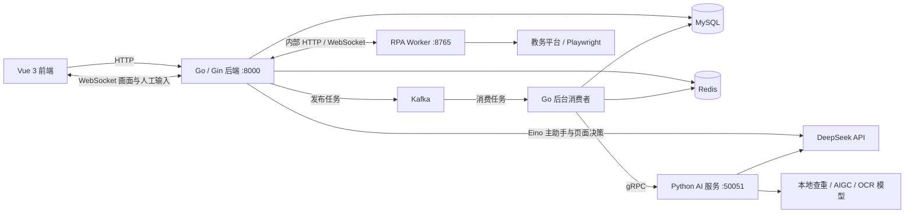

# LLM_TEACH_ASSISTANT

智能教学助理，支持从教务平台下载作业并自动批改、试卷主观题批改、学术诚信分析和对话式成绩查询。

当前版本由 **Go 业务后端 + Python AI 计算服务 + Vue 3 前端**组成。Go 负责 HTTP 接口、认证、数据管理、Eino 主助手与页面 Agent、工具调用和异步任务调度；Python 通过 gRPC 提供 OCR、查重、AIGC 检测与评分，独立的 RPA Worker 负责人工协作浏览器及附件下载。

## 主要功能

- 作业管理：按课程、班级和作业名称创建任务，配置题目要求及 JSON 评分标准。
- 批量作业批改：上传学生作业 ZIP，解析代码和文档，完成查重、AIGC 检测、代码与文档匹配分析及评分。
- 成绩池化：批改后另起后台任务，调用大模型调整整批成绩，并将调整说明附加到评语中。
- 试卷批改：配置题目、标准答案、评分标准和满分，上传学生答卷图片，生成逐题评分和整卷报告。
- 教师复核：保存人工评分、评语和复核标记，支持导出 Excel。
- 教务作业下载与批改：通过对话提供课程及作业名称，右侧控制台自动打开；人工完成官网登录与班级确认后，自动导出、下载、校验并在评分配置齐备时接续批改。
- 实时任务浏览器：WebSocket 连续传递键鼠输入并推送 Chromium 画面，支持手动完成验证码、拖动滑块、切换页面、暂停与恢复。
- AI 教学助手：快捷指令仅保留「从教务系统下载作业并批改」和「查询学生成绩」；对话也支持本地作业、试卷批改及真实任务进度查询。
- 会话与工具管理：保存聊天历史，配置内置 Tool 的启用状态、描述和可用角色，查看只读参数 Schema。Skill 作为 Markdown 任务知识包独立维护。

## 系统架构



MySQL 保存业务数据、聊天消息、异步任务和工具配置；Redis 保存业务缓存、任务状态、任务锁和最近的聊天消息。聊天记忆默认保留最近 20 条消息，Redis 有效期为 24 小时，消息异步持久化到 MySQL。

### 任务处理流程

**作业批改**：上传 ZIP -> 创建任务并返回 HTTP 202 和 `job_id` -> Kafka 消费 -> Go 拆包、解析和合并学生内容 -> Python 全班查重 -> 每位学生的 AIGC 检测、匹配分析和评分 -> 保存提交记录 -> 启动成绩池化。

**试卷批改**：上传图片 -> Kafka 消费 -> OCR 和题号识别 -> 按图片顺序合并全卷文本 -> 将全卷文本用于逐题评分 -> 汇总总分和评语 -> 保存答卷报告。

**教务作业下载并批改**：对话创建任务并打开右侧控制台 -> 独立 Worker 打开浏览器 -> 用户完成登录与验证并交还自动化 -> Go/Eino 页面 Agent 根据当前观察定位课程和作业 -> 用户明确选择班级 -> 控制器提交并关联导出记录 -> 下载和 ZIP 校验 -> 按课程、班级、作业名称匹配本地作业 -> 题目及评分标准齐备后自动投递批改任务。也可直接在控制台新建任务。

班级无法确认时等待用户核对；本地未找到作业时创建待配置记录，缺少题目要求或 JSON 评分标准时保留附件并等待补齐，之后自动继续。下载成功与批改完成分别展示。

Agent 按需加载 `grade-homework` 或 `grade-exam` Skill，通过工具核对配置、提交和查询批改任务。新工具、兼容入口 `trigger_async_pipeline` 与网页上传共用 Go 批改提交服务，先持久化任务再通过 Kafka 调度；教务抓取保留独立的下载及批改投递机制。详见 [批改 Skill 设计](docs/grading-skills.md)。

## 技术栈

| 层级 | 技术 |
| --- | --- |
| Go 后端 | Eino v0.9.21、Gin、GORM、MySQL、JWT、bcrypt、go-redis、Sarama、gRPC、Excelize |
| Python AI 服务 | grpcio、PyTorch、Transformers、PaddleOCR、scikit-learn、DeepSeek API |
| 自动化抓取 | Go/Eino 页面决策；Python Playwright、Chromium、FastAPI 执行；WebSocket 人工输入与 CDP 画面推送 |
| 前端 | Vue 3、Vite、Vue Router、Tailwind CSS、Axios、marked、DOMPurify |
| 基础服务 | MySQL、Redis、Kafka |

查重使用文本和代码嵌入模型进行相似度初筛，再由 DeepSeek 分析可疑内容；AIGC 检测分别分析文字报告和代码。当前业务数据库由 Go 的 GORM 模型管理。

## 项目结构

```text
LLM_TEACH_ASSISTANT/
├── backend-go/
│   ├── main.go                  # 启动入口、依赖初始化、HTTP 路由
│   ├── go.mod                   # Go 依赖及工具链版本
│   ├── internal/
│   │   ├── agent/               # Eino 适配、工具网关、Skill 目录、模型客户端与会话记忆
│   │   ├── browseragent/        # Go/Eino 页面决策，使用 Worker 发布的动作协议
│   │   ├── grading/             # 聊天与网页共用的批改校验、提交和状态服务
│   │   ├── auth/                # JWT 和密码处理
│   │   ├── middleware/          # 认证与角色访问控制
│   │   ├── handlers/            # HTTP 业务接口与浏览器 WebSocket 转发
│   │   ├── models/              # GORM 数据模型
│   │   ├── schemas/             # 业务请求及响应结构
│   │   ├── database/            # MySQL、Redis 和缓存一致性辅助逻辑
│   │   ├── cache/               # 业务缓存和任务状态缓存
│   │   ├── mq/                  # Kafka 生产者、批改与 RPA 消费者
│   │   ├── rpa/                 # 浏览器 Worker 客户端、任务恢复和批改投递
│   │   ├── grpcclient/          # Python 服务客户端
│   │   └── tools/               # 文件解析、批改流水线、成绩池化
│   ├── pb/                      # 生成的 Go gRPC 代码
│   └── uploads/                 # 上传文件和答卷图片
├── ai_engine_python/
│   ├── requirements.txt
│   ├── tests/                  # 真实 Chromium 行为测试与跨语言 fixture
│   └── app/
│       ├── grpc_server.py       # Python 服务入口
│       ├── core/config.py       # AI 配置和内容截取长度
│       ├── services/            # OCR、查重、AIGC 和 DeepSeek 服务
│       ├── rpa/                 # 浏览器 Worker、执行控制器和下载校验
│       ├── tools/rpa_tools.py   # 旧账号密码 RPC 的停用提示
│       ├── schemas/             # AI 报告数据结构
│       └── pb2/                 # 生成的 Python gRPC 代码
├── skills/                     # Markdown 任务知识包
│   ├── download-homework/      # 主助手创建和跟踪官网下载任务
│   ├── fetch-homework/         # 页面 Agent 的官网导航指导
│   ├── grade-homework/         # 主助手按需加载的作业批改指导
│   └── grade-exam/             # 主助手按需加载的试卷批改指导
├── proto/compute_service.proto  # Go 与 Python AI 计算服务共用协议
├── scripts/
│   ├── start.sh                # AutoDL/Linux 启动、服务检查与 Worker 协议校验
│   └── kill.bash               # 按 PID 与进程身份停止脚本启动的服务
├── docs/                       # RPA、批改 Skill、Tool 边界和架构说明
└── vue-grading-frontend/
    └── src/
        ├── services/            # HTTP 客户端、令牌刷新与浏览器流式连接
        ├── router/              # 页面路由及角色守卫
        ├── views/               # 业务页面
        └── components/          # 对话、右侧作业控制台、任务浏览器与报告组件
```

## 一键启动（当前 AutoDL 环境）

```bash
bash scripts/start.sh
```

脚本依次启动 MySQL、Redis、Kafka、RPA 浏览器 Worker、Python AI、Go 后端和前端，并检查服务是否就绪。已监听的端口会复用，不会重复启动；Go 后端未运行时先从当前源码编译。前端端口为 `6006`，启动后可关闭终端。

需要事先安装依赖、Playwright Chromium，准备模型和 MySQL 数据库，并在 `ai_engine_python/app/.env` 配置 `DEEPSEEK_API_KEY`。启动脚本读取该文件中的环境配置，再启动各服务；数据库连接可通过 `DATABASE_DSN` 覆盖。启动 MySQL/Redis 需要系统服务管理权限。默认使用仓库旁的 `teaching-runtime` 目录中的 Kafka 安装与配置；可通过 `RUNTIME_DIR`、`KAFKA_HOME`、`KAFKA_CONFIG`、`PYTHON` 覆盖路径，通过 `AI_START_TIMEOUT` 调整模型加载等待秒数（默认 300）。脚本按本机 MySQL、Redis、Kafka 及默认业务端口检查服务。

日志和 PID 保存在 `teaching-runtime`，JWT 密钥首次生成后保存在权限为 600 的 `.jwt.env` 中复用。失败会返回非零状态，已经启动的服务继续运行，查看对应日志后可重新执行脚本。该脚本用于现有开发环境，不负责安装依赖。

| 服务 | 默认端口 | 运行目录中的日志 |
| --- | --- | --- |
| 前端 Vite | `6006` | `frontend.log` |
| Go HTTP / WebSocket | `8000` | `backend.log` |
| Python AI gRPC | `50051` | `ai.log` |
| RPA 浏览器 Worker（仅本机） | `8765` | `rpa.log` |
| Kafka | `9092` | `kafka.log` |
| MySQL / Redis | `3306` / `6379` | 启动脚本启动服务时记录 `mysql.log` / `redis.log` |

停止脚本启动的应用进程及 Kafka：

```bash
bash scripts/kill.bash
```

停止脚本会核对 PID、进程组和工作目录，保留 MySQL、Redis 运行；没有对应 PID 记录的手动启动进程不会由它接管。默认等待 60 秒，可用 `STOP_TIMEOUT` 调整，超时返回失败并保留 PID 文件，不强制终止。

升级 Go 或 Worker 代码时，先妥善结束现有浏览器任务，再执行：

```bash
bash scripts/kill.bash && bash scripts/start.sh
```

Worker 重启后需要重新登录，已校验附件和导出检查点保留。启动脚本会校验 `browser.v1`、`go-eino` 和 `browser.stream.v1`，避免复用缺少流式接口的旧 Worker；已经运行的 Go 服务仍需重启才能加载新代码。

## 本地启动

以下步骤按 Linux 单机开发环境说明。每个服务使用独立终端，命令均从仓库根目录开始执行。

### 1. 环境准备

| 依赖 | 项目要求或已有环境记录 |
| --- | --- |
| Go | `go.mod` 声明 `1.25.5` |
| Python | 当前开发环境为 `3.11.17` |
| Node.js | 当前开发环境为 `20.20.2` |
| MySQL | `8.0+`，默认 `127.0.0.1:3306` |
| Redis | 默认 `localhost:6379` |
| Kafka | 默认 `localhost:9092` |
| antiword | 用于旧版二进制 `.doc` 文档转文本；Ubuntu 可执行 `apt-get install -y antiword` |

Python 依赖包含 CPU/GPU 推理库及旧文件解析库，安装时需要按本机 CUDA、PyTorch 和 PaddlePaddle 环境调整。已有环境说明记录了 `textract` 的旧 pip 兼容问题，详见 [环境配置.md](环境配置.md)。

### 2. 初始化基础服务

启动 MySQL、Redis 和 Kafka。在 MySQL 中创建数据库：

```sql
CREATE DATABASE grading_system
  CHARACTER SET utf8mb4
  COLLATE utf8mb4_general_ci;
```

Go 启动时通过 GORM `AutoMigrate` 初始化表结构，并在工具配置表为空时写入默认工具，补齐 RPA 和批改工具。`ToolDefinition` 显式沿用历史 `skill_definitions` 表，保留已有开关和角色配置。批改 Skill 默认从项目 `skills/` 查找，部署时可通过 `TEACH_SKILLS_DIR` 指定绝对路径。

提前创建 Kafka 主题，或配置 broker 允许自动创建。以下命令使用 Kafka 安装目录下的工具，按单机环境配置：

```bash
for topic in topic_grading_homework topic_grading_exam topic_rpa_fetch; do
  bin/kafka-topics.sh --bootstrap-server localhost:9092 \
    --create --if-not-exists --topic "$topic" \
    --partitions 1 --replication-factor 1
done
```

### 3. 核对配置

| 配置 | 当前读取位置 |
| --- | --- |
| MySQL DSN | 环境变量 `DATABASE_DSN`；未设置时使用 `backend-go/main.go` 中的本机 `grading_system` 开发配置 |
| Go 监听地址 | 环境变量 `BACKEND_ADDR`，默认 `:8000`；更改端口时需同步调整前端代理与启动检查 |
| Kafka broker | `backend-go/main.go` 中的 `kafkaBrokers` |
| Python gRPC 地址 | `backend-go/internal/grpcclient/client.go`，默认 `localhost:50051` |
| Redis | 环境变量 `REDIS_ADDR`、`REDIS_PASSWORD`、`REDIS_DB` |
| DeepSeek 密钥 | Go 从环境变量 `DEEPSEEK_API_KEY` 读取；Python 支持该环境变量及 `ai_engine_python/app/.env` |
| JWT | 环境变量 `JWT_ACCESS_SECRET`、`JWT_REFRESH_SECRET`；有效期可通过 `JWT_ACCESS_EXPIRY_MINUTES` 和 `JWT_REFRESH_EXPIRY_DAYS` 配置 |
| 前端 API 与答卷图片地址 | `VITE_API_BASE_URL`，默认空值，使用浏览器当前站点；开发时由 Vite 代理到 `http://127.0.0.1:8000` |
| Skill 目录 | `TEACH_SKILLS_DIR`，启动脚本默认设为项目 `skills/` |
| RPA 控制连接 | `RPA_CONTROL_URL`、`RPA_CONTROL_TOKEN_FILE`，Go/Python 使用相同内部令牌文件 |
| RPA 浏览器与下载 | `RPA_PROXY_URL`、`PLAYWRIGHT_BROWSERS_PATH`、`RPA_DOWNLOAD_DIR`、`RPA_MAX_TASKS` |

手动运行 Go 不会自动加载 Python 的 `.env`，需要在 Go 终端单独配置环境变量；`scripts/start.sh` 已处理环境配置传递。`VITE_*` 配置在前端启动或构建时读取。

本地查重及 AIGC 模型目前使用固定路径，需要准备以下模型或修改相应服务中的模型路径：

```text
/root/autodl-tmp/dzq/models/bert-base-chinese
/root/autodl-tmp/dzq/models/unixcoder-base
/root/autodl-tmp/dzq/models/chatgpt-detector-roberta-chinese
/root/autodl-tmp/dzq/models/chatgpt-detector-roberta
```

路径分别配置于 `plagiarism_service.py` 和 `aigc_service.py`。OCR 由 PaddleOCR 初始化；使用 GPU 时需保证推理库与驱动兼容。

### 4. 启动 Python AI 服务

```bash
cd ai_engine_python
python -m venv .venv
source .venv/bin/activate
python -m pip install -r requirements.txt
export PLAYWRIGHT_BROWSERS_PATH="$PWD/../../.playwright"
python -m playwright install --with-deps chromium
export DEEPSEEK_API_KEY='你的 DeepSeek API 密钥'
python app/grpc_server.py
```

模型初始化完成后，服务监听 `50051`。Playwright 已列入依赖，Chromium 需另外安装。作业抓取 Worker 需要在另一个终端单独启动；仓库的 `scripts/start.sh` 会同时启动这两个进程。

```bash
cd ai_engine_python
source .venv/bin/activate
export PLAYWRIGHT_BROWSERS_PATH="$PWD/../../.playwright"
python -m app.rpa.worker
```

RPA 浏览器可使用独立代理。在 `ai_engine_python/app/.env.rpa` 中配置：

```dotenv
RPA_PROXY_URL=http://127.0.0.1:18080
```

Worker 为每个任务固定使用同一个浏览器和网络路径。未设置代理时直连；设置后只影响 RPA Chromium。旧 `RPA_NETWORK_MODE` 参数不再使用。

可复制 `ai_engine_python/app/.env.rpa.example`；真实配置已被 Git 忽略。环境变量 `RPA_PROXY_URL` 优先于此文件，设为空可取消独立代理。修改代理后重启 Worker。使用上述地址时需保持 SSH 反向隧道和本地代理运行。

RPA 当前适配 `https://learning.xidian.edu.cn/portal`。下载目录默认为项目根目录下的 `downloads/<job_id>/`，可用 `RPA_DOWNLOAD_DIR` 调整。Go 必须能读取同一路径；跨容器部署需共享该目录。

### 5. 启动 Go 后端

```bash
cd backend-go
export DEEPSEEK_API_KEY='你的 DeepSeek API 密钥'
export DATABASE_DSN='数据库用户:数据库密码@tcp(127.0.0.1:3306)/grading_system?charset=utf8mb4&parseTime=True&loc=Local'
export REDIS_ADDR='localhost:6379'
export JWT_ACCESS_SECRET='替换为自己的访问令牌密钥'
export JWT_REFRESH_SECRET='替换为自己的刷新令牌密钥'
go mod download
go run .
```

后端监听 `http://127.0.0.1:8000`。从 `backend-go` 目录启动，使相对路径 `./uploads` 与静态文件服务保持一致。MySQL 和 Redis 必须可连接，网页异步批改和 RPA 抓取还需要 Kafka 可用。

### 6. 启动前端

```bash
cd vue-grading-frontend
npm install
npm run dev
```

访问终端输出的 Vite 地址，通常为 `http://localhost:5173`；一键启动脚本固定使用 `6006`。前端默认请求同源路径，Vite 转发 `/api`、作业、试卷和图片请求，并为 `/api/rpa/jobs` 启用 WebSocket 转发。从远程机器访问时使用实际前端入口；使用 AutoDL 入口时，`AutoDLService6006URL` 用于 Vite 允许的主机名配置。

生产前端可运行 `npm run build` 生成 `dist/`，托管服务器需要转发业务 API、`/uploads` 和 `/api/rpa/jobs/:id/stream` 的 WebSocket Upgrade，并支持前端路由回退。前后端分离部署时通过 `VITE_API_BASE_URL` 指定浏览器可访问的后端地址，并用 Go 环境变量 `RPA_BROWSER_ALLOWED_ORIGINS` 配置允许的完整前端 Origin（含协议及端口，多个值用逗号分隔）。Vite 的开发代理不会随 `dist/` 部署。

## 作业抓取浏览器控制台

教师或管理员登录后，在「AI 教学助手」中使用快捷指令「从教务系统下载作业并批改」，或直接发送：

> 请从教务系统下载“操作系统”课程的“第一次作业”并批改。

1. 提供课程和作业名称，同名课程需要时补充学期。AI 创建任务后，**右侧自动弹出「作业下载与批改」控制台并选中该任务**。也可点击「打开作业控制台」，填写名称后点击「启动抓取」直接创建。
2. 在任务浏览器中完成登录：点击画面中的输入框，用键盘或「填写并清空」输入账号、密码和验证码；滑块验证可手动拖动。账号密码及验证码无需发到聊天里。
3. 登录完成后，控制台显示「已登录，等待继续」，仍需点击「交还自动化」。页面 Agent 根据当前控件逐步定位课程和作业。
4. 导出前确认具体班级或明确选择全部班级；导出归属不明确时，核对本次导出的记录。系统随后下载并校验 ZIP。
5. 题目要求与 JSON 评分标准齐全时自动进入批改队列；缺项时在「作业管理」补齐，系统自动继续。班级识别错误时可在附件行更正关联。
6. 可随时「暂停并接管」「交还自动化」或取消任务。收起控制台只断开前端浏览器连接并停止该面板的状态轮询，后台任务继续；通过聊天中的任务按钮或页面上的「打开作业控制台」重新进入。

聊天区仅保留两个快捷指令，旁边不再展示功能说明卡片；作业控制台按需从右侧展开，不占据聊天顶部。手机端控制台适配为全屏宽度。

键鼠输入和画面通过 WebSocket 持续传递，下一条输入不等待上一条确认，拖动时画面继续更新。Worker 通过 Chromium CDP 推送画面，发送上限约 30 帧/秒，静态页面约每秒补一帧；慢连接仅保留最新待发送画面。实际延迟取决于网络、浏览器和官网响应。断线后会自动重连，但不会重放未确认的输入；失焦或断线时取消按下状态，避免意外点击。

每个任务使用独立浏览器与下载目录，只有任务创建者能查看或控制。人工键鼠输入不经过模型，也不持久化密码与验证码；无需开放 VNC 端口。刷新网页后可以从控制台的「我的任务」继续查看。人工等待无操作 15 分钟或单次浏览器会话达到 2 小时后会中断并关闭浏览器；Worker 重启也会丢失登录状态。重新登录恢复时保留已校验附件和导出检查点。

控制服务是独立进程，**仅监听 `127.0.0.1:8765`**，由 Go 的认证接口转发。内部共享令牌保存在运行目录的 `.rpa-control-token`（权限600），可用 `RPA_CONTROL_TOKEN_FILE` 为 Go/Python 指定同一路径。启动脚本自动设置该路径。修改 Worker 端口时同时设置 Go 的 `RPA_CONTROL_URL`。控制服务应保持仅本机可访问。

浏览器 WebSocket 在建立连接后的第一条消息中发送 JWT；Go 校验 Origin、令牌有效期、教师/管理员角色和任务归属，再转发到内部 Worker。访问令牌到期会结束连接，前端重连时通过现有 HTTP 认证流程检查并刷新登录。

导航采用「当前页面观察 → 模型选择动作 → 执行并重新观察」。旧脚本中已验证的导出入口、班级勾选与下载中心规则保留在平台适配器；导出提交、文件校验及任务状态由控制器执行。无法识别的改版页面会请求人工接管。下载后自动匹配作业，缺少题目要求或 JSON 评分标准时显示「等待题目与评分标准」，补齐后自动批改；班级识别错误时可在附件行更正关联。详细模块职责、恢复机制和验证方法见 [RPA 实现说明](docs/rpa-implementation.md)。

## 使用流程

### 作业批改

1. 注册或登录教师账户，进入作业管理页面。
2. 创建作业，填写课程、班级、任务名称、题目要求和 JSON 评分标准。
3. 进入作业详情，上传包含学生材料的 ZIP。外层批量上传仅支持 `.zip`；学生材料中的嵌套 ZIP/RAR 由文件解析器处理。
4. 等待后台批改，点击刷新结果查看评分、评语、查重、AIGC 和代码与文档匹配报告。
5. 按需人工复核并导出 Excel。

外层 ZIP 建议按 `学号-姓名` 分目录；解析器以首层目录作为学生标识，并按第一个 `-` 拆分学号和姓名：

```text
submissions.zip
├── 20260001-ZhangSan/
│   ├── report.docx
│   └── source.zip
└── 20260002-LiSi/
    ├── report.pdf
    └── main.go
```

### 试卷批改

1. 创建试卷，逐题填写题号、题目、标准答案、文本评分标准和满分。
2. 进入试卷详情，填写学生学号并按页序上传多张答卷图片。
3. 等待处理后刷新成绩列表，进入学生报告查看逐题评分、总评和对应图片。

### AI 教学助手

- 默认快捷入口：**从教务系统下载作业并批改**、**查询学生成绩**。
- 成绩查询：例如“查询学生 20260001 的作业和试卷成绩”。学生角色的查询参数会被替换为本人用户名（学号）。
- 本地批改：提供作业 ID 和 Go 服务可读取的 ZIP 路径。
- 试卷批改：提供试卷 ID、学生学号和按页排序的图片路径；可先询问该试卷的评分配置是否齐备。
- 批改进度：提供本次任务 ID 查询状态；网页上传已自动提交的材料不需要再次通过聊天提交。
- 教务抓取：提供课程名称、作业名称及可选学期，创建下载及批改任务；完整登录在任务浏览器中完成。

前端学生角色仅开放 AI 助手页面；教师和管理员可访问作业、试卷页面。工具管理路由允许教师和管理员，侧边栏入口仅向管理员展示。工具执行器及参数 Schema 由 Go 代码定义，管理页面配置开关、角色及描述。Skill 知识包位于 `skills/`，不注册工具或授予权限。设计边界及兼容策略见 [Tool 与 Skill 边界](docs/tool-skill-boundaries.md)。

## 主要接口

| 路径 | 用途 |
| --- | --- |
| `/api/login`、`/api/register`、`/api/refresh` | 登录、注册、令牌刷新 |
| `/api/profile` | 当前用户信息 |
| `/api/sessions` | 会话管理及历史消息 |
| `/api/agent/chat` | Agent 对话 |
| `/api/jobs/:job_id` | 异步任务状态查询 |
| `/api/rpa/jobs` | 创建抓取任务、列出本人任务 |
| `/api/rpa/jobs/:id` | 下载任务详情、附件及批改状态 |
| `/api/rpa/jobs/:id/stream` | WebSocket 实时画面与人工输入，首条消息认证 |
| `/api/rpa/jobs/:id/:action` | 暂停、恢复、取消、重试、班级范围确认等控制操作 |
| `/api/rpa/jobs/:id/browser`、`/api/rpa/jobs/:id/input` | 兼容的 HTTP 画面及输入接口 |
| `/api/admin/tools` | 工具配置管理；`/api/admin/skills` 为兼容别名 |
| `/assignments/` | 作业管理、提交、结果和导出 |
| `/submissions/:id` | 提交详情、人工复核和删除 |
| `/exams/` | 试卷管理、题目、学生交卷和报告 |
| `/uploads` | 答卷图片等静态资源 |

HTTP 受保护接口使用 `Authorization: Bearer <access_token>`；WebSocket 使用首条消息认证。普通批改任务状态包括 `PENDING`、`PROCESSING`、`SUCCESS` 和 `FAILED`，查询优先读取 Redis，未命中时回退 MySQL。下载与附件批改的显示含义如下：

| 状态 | 含义 |
| --- | --- |
| `WAITING_USER` | 等待人工登录、选择班级或处理其他接管事项 |
| `SUCCEEDED` / `PARTIAL_SUCCESS` | 下载及文件校验全部成功 / 部分成功 |
| `WAITING_RUBRIC` | 等待确认班级、匹配本地作业或补齐题目与评分标准 |
| `READY` / `PUBLISHED` | 准备投递批改 / 已投递批改队列 |
| 附件行的 `SUCCESS` | 该附件对应的主批改任务完成 |
| `INTERRUPTED` | 浏览器会话中断，需要重新登录恢复 |

## 验证

以下命令从项目根目录开始执行；先安装依赖和 Chromium，并确认 `PLAYWRIGHT_BROWSERS_PATH` 与安装浏览器时一致：

```bash
cd backend-go
go test ./...

cd ../ai_engine_python
export PLAYWRIGHT_BROWSERS_PATH="$PWD/../../.playwright"
.venv/bin/python -m unittest discover -s tests -p 'test_rpa_worker.py' -v

cd ../vue-grading-frontend
node --test src/services/browserInputQueue.test.js src/services/browserStream.test.js
npm run build
```

Python 行为测试使用真实 Chromium 和本地拦截页面，覆盖登录交接、班级确认、下载校验、输入顺序、拖动中的画面推送、断线取消、页面切换和控制权失效。Go 包含主助手、工具权限、任务调度与流式连接测试；需独立 MySQL 的集成测试只在设置 `RPA_TEST_DSN` 后运行，数据库名必须以 `rpa_test_` 开头，不应连接业务数据库。

Go/Eino → Python Worker → Chromium 的跨语言闭环测试需显式设置 Python 路径，从项目根目录执行：

```bash
cd backend-go
RPA_BROWSER_PYTHON="$PWD/../ai_engine_python/.venv/bin/python" \
PLAYWRIGHT_BROWSERS_PATH="$PWD/../../.playwright" \
go test ./internal/rpa -run TestEinoThroughPythonWorkerDownloadsVerifiedArchive -count=1 -v
```

前端已通过模拟 API 的浏览器交互检查：两个快捷指令、任务响应打开右侧控制台、选中指定任务、收起与重开、历史任务切换、远程键盘和窄屏布局。模拟回归不代表已完成真实教师账号、当前官网页面及在线模型的端到端验收。

## 当前迁移状态

- 业务 HTTP 由 Go 提供，AI 计算通过 Python gRPC 提供；FastAPI 用于独立的浏览器 Worker。Python 中保留的 `grading_service.py`、`langgraph_agent.py` 未接入当前主入口。
- 前端单份作业批改页面仍调用 `/homework/grade`，当前 Go 未注册该接口；批量作业请通过作业详情页提交。
- 前端 `getJobStatus()` 已对齐 `/api/jobs/:job_id`；普通作业和试卷详情页仍通过手动刷新查看结果。作业控制台展开时每 2 秒轮询所选下载任务状态，浏览器画面独立使用 WebSocket。
- 聊天历史目前只持久化文字，重新打开历史会话不会恢复任务按钮；下载任务可通过右侧控制台的「我的任务」重新查看。
- RPA 找不到匹配作业时创建待配置作业，等待题目和评分标准齐备后投递批改。旧账号密码抓取 RPC 已停用，旧任务需重新创建。
- 成绩池化在独立 goroutine 中执行，批改任务的 `SUCCESS` 状态不表示池化已经结束。
- 根目录 Dockerfile 仍是占位模板，Python 和前端 Dockerfile 为空，仓库尚未提供完整的容器编排启动配置。

## Go/Eino 与浏览器 Worker 配置

主助手和页面 Agent 均在 Go 运行。Python 浏览器 Worker 不读取导航 Skill、不调用模型；计算服务继续提供既有 OCR、Embedding、查重和评分能力。

- `TEACH_SKILLS_DIR`：Skill 根目录；按 `skill.yaml` 的 `runtimes` 发现主助手与页面 Skill。下载任务固定正文、发布号与内容哈希。
- `AGENT_MODEL`、`AGENT_MODEL_URL`：Go 模型名称及完整 Chat Completions URL，默认 `deepseek-chat` 与 `https://api.deepseek.com/v1/chat/completions`。
- `DEEPSEEK_API_KEY`：默认模型密钥；`PAGE_AGENT_API_KEY`、`PAGE_AGENT_MODEL`、`PAGE_AGENT_MODEL_URL` 可覆盖页面 Agent 配置。
- `RPA_CONTROL_URL`、`RPA_CONTROL_TOKEN_FILE`：Go 到 Worker 的内部连接与认证。
- Worker 使用 `RPA_PROXY_URL`、`RPA_MAX_TASKS`、`PLAYWRIGHT_BROWSERS_PATH`；不再使用 `RPA_AGENT_MODEL`。

升级需同时更新 Go 与浏览器 Worker。重新编译并重启后，浏览器会话需要重新登录；暂停任务也不会让登录状态跨 Worker 重启保留。启动及停止命令见上文，`scripts/start.sh` 会复用已经监听的进程。

任务表由 GORM 增加导航 Skill/协议快照、待确认动作和决策租约字段。Go 崩溃后先重发同一动作 ID 核对回执，再请求模型决策。创建任务和聊天接口支持 `Idempotency-Key`；重复请求需沿用同一键，新任务使用新键。

## 进一步阅读

- [RPA 实现说明](docs/rpa-implementation.md)：右侧控制台、流式浏览器、恢复与下载后批改。
- [Go/Eino/Python 实施说明](docs/go-eino-python-implementation.md)：主助手、页面 Agent、执行协议与持久化。
- [批改 Skill 实现](docs/grading-skills.md)：本地作业和试卷批改的工具调用链与配置校验。
- [Tool 与 Skill 边界](docs/tool-skill-boundaries.md)：工具管理、Markdown 知识包及兼容策略。
