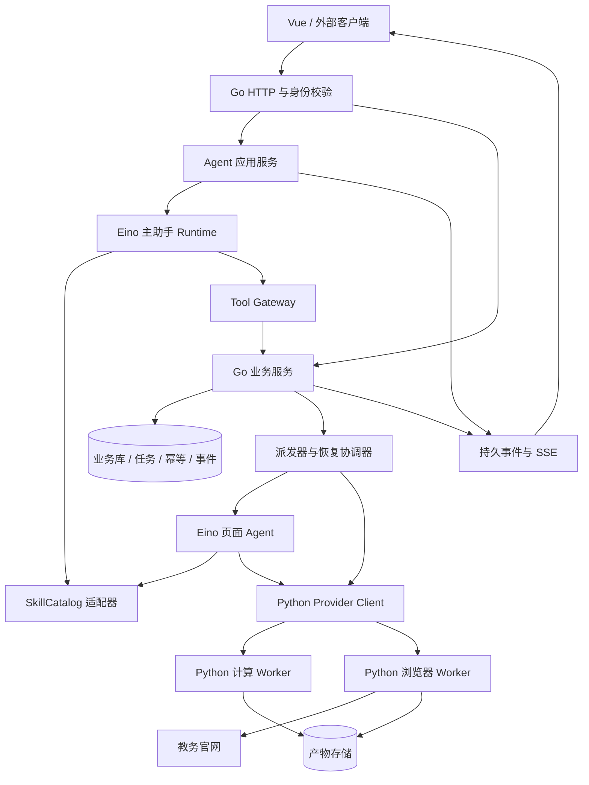
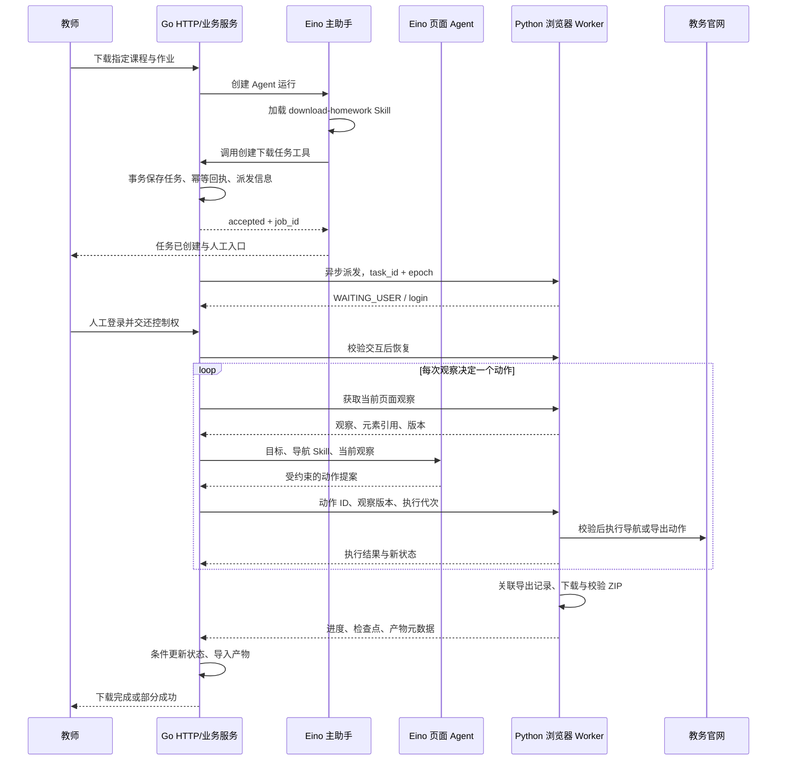

# Go + Eino + Python 架构迁移设计

日期：2026-10-08。状态：拟议方案；本文件不代表代码已完成迁移。

## 1. 目标与关键决策

Go 负责对外 HTTP、身份与业务归属校验、业务服务、任务状态和调度；Eino 嵌入 Go 服务，负责模型与 Agent 运行；Python 提供浏览器操作、文档处理、Embedding 和模型计算。Tool 是能力的调用接口，实现可以在 Go 或 Python。

本次迁移承接 [Tool 与 Skill 管理规范化方案](tool-skill-management-design.md)。该文档的描述协议、版本管理和对外分发原则继续适用；本方案进一步确定 Eino 的接入位置，以及 Go/Python 的状态与调用边界。页面决策与导航 Skill 加载直接迁入 Go/Eino，Python 浏览器 Worker 不调用大模型、不加载 Skill。原管理方案中两种语言各保留 Agent 循环的安排以此处为准。

确定以下设计决策：

1. Eino 首期作为 Go 内部依赖部署，不新增独立 Agent 微服务。
2. 主助手采用 Eino ADK；固定业务步骤由业务服务和任务控制器执行。
3. 优先复用 Eino Skill 中间件，通过项目目录适配器补充依赖检查、版本固定和运行记录。
4. Go 是业务任务状态的权威入口；Python 是浏览器实时状态和执行进度的来源。
5. 长下载任务提交后返回任务引用，独立于聊天连接继续运行。
6. 业务任务、Agent 检查点、浏览器会话分别管理，通过 ID 关联。
7. 初期复用计算 gRPC 与浏览器 Worker HTTP，统一语义而不强制统一传输。
8. 网页、Agent Tool 和未来 CLI/MCP 复用同一业务服务。
9. 主助手与页面 Agent 均由 Go/Eino 实现；页面 Agent 作为后台下载任务的执行组件，独立于主助手本轮生命周期。

教师修改全局工具策略仍不纳入本轮。此次也不引入插件市场、独立向量平台或复杂多 Agent 分工；这些不能作为完成首批迁移的前提。

## 2. 现有基础与迁移范围

本次核对到的代码基础：

| 现有位置 | 当前行为 | 迁移处理 |
| --- | --- | --- |
| `backend-go/internal/agent/runtime.go` | 自研模型/工具循环、按需加载 Skill、工具权限与单轮去重 | 保留业务语义，逐步由 Eino Runtime 与 Tool Gateway 接管 |
| `backend-go/internal/agent/tools.go` | 工具注册、Schema 导出、用户相关执行器 | 增加统一描述和适配器，首期复用执行器 |
| `backend-go/internal/agent/skill_catalog.go` | 固定加载两个批改 Skill，版本为正文哈希 | 扩展为目录索引、发布版本和内容哈希，兼容旧哈希记录 |
| `backend-go/internal/rpa/service.go` | Go 持久任务、派发、Worker 状态同步及批改接续 | 保留业务入口，补强跨请求幂等和状态协议 |
| `ai_engine_python/app/rpa/agent.py` | Python 页面决策循环，读取导航 Skill | 将决策与 Skill 加载直接迁入 Go/Eino；新 Worker 移除对 DownloadAgent 的运行依赖 |
| `ai_engine_python/app/rpa/task_controller.py` | 页面动作校验、人工接管、导出检查点和文件校验 | 保留为浏览器执行控制器，避免在 Go 复制细粒度页面规则 |
| `ai_engine_python/app/rpa/worker.py` | HTTP 控制入口、任务快照、重启中断处理 | 逐步增加调用去重、执行代次和观察版本 |
| `proto/compute_service.proto` | 文本提取、查重、评分等计算 RPC，另有旧抓取接口 | 计算协议兼容扩展；旧抓取入口核查调用后再下线 |

当前 `RunDialogue` 的去重主要在一次运行的内存中；它不能代替持久幂等。当前 Go 会按 `state_version` 保存 Worker 状态；迁移需要进一步处理 Worker 重启、重复回报和取消竞争，不能把这些视为已经解决。

## 3. 总体结构



Eino 位于 Go 的 Agent 实现层。业务服务不导入 Eino 类型；Python 不接收 Eino 内部对象；前端不解析框架原始事件。这样 Eino 升级主要影响适配层。

### 3.1 职责边界

| 模块 | 负责 | 关键约束 |
| --- | --- | --- |
| HTTP Handler | 参数解析、身份、流式连接、响应转换 | 不直接编排浏览器动作 |
| Agent 应用服务 | 创建运行、取消、恢复、关联任务与事件 | 不把 HTTP 请求生命周期当作后台任务生命周期 |
| Eino Runtime | 模型调用、工具选择、上下文、框架检查点 | 模型不能直接修改任务表 |
| SkillCatalog | 目录、版本、依赖、资源读取 | 加载知识不授予业务权限 |
| Tool Gateway | Schema、上下文注入、业务前置条件、执行回执 | 执行时再次校验身份和任务归属 |
| Go 业务服务 | 创建任务、状态转换、幂等、派发、批改接续 | 网页/API 与 Tool 复用 |
| Python 执行控制器 | 页面观察、动作执行、导出保护、下载校验 | 不决定教师权限或是否自动启动评分 |
| Python 计算服务 | OCR、解析、Embedding、模型计算 | 返回计算结果，由 Go 决定业务落库和后续动作 |

Go 调度控制器管理“这个任务能否启动、等待谁、何时终止”；Python 执行控制器管理“当前页面允许执行哪个动作、是否已提交导出、下载文件是否有效”。两个控制器有不同职责，避免同时维护同一套页面状态机。

## 4. Eino 的使用方式

### 4.1 主助手

使用 `ChatModelAgent` 与 `Runner` 接管现有主助手循环，保留现有角色可见工具、Skill 前置关系、提交后结束本轮等行为。Eino 提供模型与工具循环、事件以及中断恢复入口；这些是框架能力。[官方 ADK 概览](https://www.cloudwego.io/docs/eino/core_modules/eino_adk/agent_preview/)

运行开始时生成不可变快照，包含 Runtime 版本、模型配置标识、可用工具协议与 Skill 发布绑定。模型收到简短的任务规则和 Skill 元数据，通过加载操作获得正文。

首期不使用 DeepAgent 或自动规划器。教师提出“下载某课程某次作业”后，主助手需要理解目标、处理缺项并提交业务任务；下载内部的固定步骤已有控制器负责。

### 4.2 页面 Agent

页面 Agent 直接使用 Go/Eino 实现，加载 `fetch-homework` 导航 Skill、调用页面决策模型、处理工具结果并决定下一步。新 Worker 不保留 Python 模型决策循环，也不要求配置页面决策模型密钥。

Go 调度器驱动一个独立于聊天的后台任务：获取 Worker 页面观察 → Eino 页面 Agent 提出动作 → Go 检查任务与控制权 → Worker 校验并执行 → 获取新观察。每个观察允许一个已登记的页面变更动作，防止 Agent 在页面变化后连续使用旧元素引用。

页面 Agent 只接收目标、阶段、当前观察、近期动作和必要 Skill。主助手完整聊天历史不进入页面 Agent。需要嵌套 Agent 时可使用 AgentAsTool，但长期下载由持久任务调度，不依赖主助手保持工具调用未返回。

Python 保留 Playwright 会话、确定性的页面适配、动作参数与版本校验、导出提交检查点、下载监听、ZIP 校验、人工输入和控制权保护。它可以执行下载进度轮询、等待页面加载等确定性过程；选择下一步页面动作与解释导航 Skill 由 Go/Eino 负责。

迁移时将 `DownloadAgent.decide` 的提示、模型配置与导航 Skill 加载迁到 Go，将 `task_controller.py` 内“调用 decide 后自行推进”的路径改为外部动作驱动。动作 Schema 以 Provider 的版本化描述为依据，Go 工具适配器与 Python 校验器使用同一协议，避免复制两份漂移的定义。

需要为主助手与页面 Agent 分别设置模型调用预算、并发和运行上下文，可复用同一模型服务。新增的观察/动作 RPC 会增加通信开销，应返回经过裁剪的页面结构与元素引用；浏览器会话和文件留在 Worker，避免每一步传完整 DOM、截图和下载文件。

### 4.3 Skill 接入

Eino 已有 Skill 中间件和 Backend 接口，支持先列元数据、再取正文。[官方 Skill 中间件](https://www.cloudwego.io/docs/eino/core_modules/eino_adk/eino_adk_chatmodelagentmiddleware/middleware_skill/)

项目实现 `CatalogBackend` 适配：

1. `List` 只返回适用当前 Runtime、已启用且依赖就绪的 Skill。
2. `Get` 使用本次运行固定的版本读取正文，验证资源路径和内容哈希。
3. 正文成功加载后记录 `skill.loaded` 事件与本轮绑定；目录列出不等于加载。
4. Tool Gateway 执行时检查代码登记的 Skill 前置关系。
5. 后续参考文件读取仍限制在对应发布包内。

首期使用 inline Skill，避免每个 Skill 触发新 Agent。`skill.yaml` 是项目扩展，Eino 不自动理解其中的发布、依赖或授权语义，须由适配层处理。

现有 `load_skill({name})` 可暂保留兼容工具；若切换原生 Skill 工具，显式适配其参数名称。仅修改工具名不足以保证参数兼容，同一运行不同时暴露两套等价入口。

### 4.4 稳定应用接口

以下为项目接口示意，不是 Eino API 签名：

```go
type AgentRuntime interface {
    Start(ctx context.Context, input RunInput) (RunHandle, error)
    Resume(ctx context.Context, input ResumeInput) (RunHandle, error)
    Cancel(ctx context.Context, runID string) error
}

type ToolExecutor interface {
    Execute(ctx context.Context, call ToolCall) (ToolResult, error)
}
```

Eino 实现藏在 `internal/agent/eino`；旧运行时通过同一接口接入。共享工具描述可以复用，但携带用户身份的执行器与本轮状态不能在不同用户运行间共享可变字段。

## 5. Tool 与 Python Provider 协议

### 5.1 工具调用链

```text
Eino Tool Adapter
  → Tool Gateway
  → Go 业务服务
  → Python Provider Client（需要时）
  → Python 执行器
```

ToolDescriptor 维护内部 ID、模型名称/别名、输入输出 Schema、协议版本、执行模式、副作用类别、超时和重试规则。描述由代码拥有；管理配置只能调整允许的展示与启用字段，不能改写执行器 Schema。

Gateway 执行顺序：参数验证 → 身份/归属 → Skill 与业务阶段 → 幂等登记 → 执行或派发 → 结果验证 → 持久回执与事件。输出给模型前去除内部路径和敏感运行信息。

### 5.2 调用上下文

| 字段 | 生成方与用途 |
| --- | --- |
| actor_id / role | Go 从认证会话取得，模型不能覆盖 |
| run_id | 一次 Agent 运行 |
| task_id | 一个持久业务任务，允许关联多次运行 |
| invocation_id | 一次逻辑工具调用，传输重试保持不变 |
| idempotency_key | 一个业务操作的去重键，不依赖模型随意生成的 call ID |
| trace_id | 串联 Go、Python 与事件日志 |
| skill_bindings | 固定发布号与内容哈希 |
| deadline | 当前调用时限，区别于后台任务截止时间 |
| attempt / execution_epoch | 技术重试次数与任务执行代次 |

幂等键按用户、操作和客户端请求/任务步骤建立作用域。仅用输入参数哈希会阻止用户合法的新建任务；仅用工具调用 ID 则挡不住模型再次生成的新调用。新建接口支持客户端请求键，任务内部步骤使用持久操作键。

### 5.3 统一 ToolResult

```json
{
  "outcome": "accepted",
  "message": "下载任务已创建，请完成官网登录",
  "data": {
    "job_id": "job-123",
    "job_type": "rpa_fetch_homework",
    "job_status": "WAITING_USER"
  },
  "interaction": {
    "id": "interaction-123",
    "kind": "human_browser",
    "reason": "login",
    "url": "/tasks/job-123/browser"
  },
  "artifacts": [],
  "error": null
}
```

`outcome` 为 `completed / accepted / needs_input / failed`。业务任务的状态独立表达。`accepted` 表示调用已受理，不是下载完成；`needs_input` 表示当前调用缺输入，不自动等同于所有任务进入 `WAITING_USER`。

业务拒绝与可预期失败放入结构化 `error`，包含 code、message、retryable 和恢复建议。传输错误由适配器规范化；官网提交结果不确定时返回 `ACTION_OUTCOME_UNKNOWN`，禁止自动再次提交，任务进入核对流程。无法得知结果时不能直接把任务标成失败并重建。

兼容期保留旧响应所需的顶层 `job_id/job_type/result_url` 映射，业务层内部只维护一份规范结果。

### 5.4 跨语言传输

| 能力 | 初期传输 | 设计要求 |
| --- | --- | --- |
| 文本提取、评分等已有计算 | 现有 gRPC | 向后兼容扩展，新增字段不复用旧编号 |
| 浏览器任务控制 | 现有 Worker HTTP | 延续认证和任务 ID，逐步补充统一调用上下文 |
| 页面观察/动作 | Worker HTTP 扩展 | 观察版本、动作 ID、执行代次和控制权校验 |
| Embedding | 新增有类型的计算 RPC | 批处理、模型版本、维度和输入限制 |
| 大文件与截图 | Artifact 引用 | 控制协议传 ID 与元数据，不传巨大 Base64 |

旧 `FetchPortalHomework` 包含账号密码字段。先核查调用方，官网交互下载逐步统一到人工浏览器任务入口；保持必要兼容窗口，不能只删除 proto 字段就宣称已迁移。

## 6. 任务状态、恢复与幂等

### 6.1 状态归属

| 状态对象 | 保存位置 | 恢复依据 |
| --- | --- | --- |
| 业务任务 | Go 业务库 | 状态、目标、归属、执行代次、步骤与产物 |
| Agent 运行 | Go 运行仓储 | Runtime/模型/Skill 快照、关联任务、结束原因 |
| Agent 检查点 | Eino CheckPointStore 的持久实现 | 对话与可序列化的框架执行状态 |
| 浏览器执行状态 | Python Worker 快照 | 当前阶段、导出关联、已验证下载、会话有效性 |
| 浏览器登录会话 | Worker 浏览器环境 | 重启后主动验证，失效则重新人工登录 |

Eino 的中断恢复要求配置检查点存储；其检查点不会保存 Playwright 活对象或保证外部副作用去重。[官方 Runner 文档](https://www.cloudwego.io/docs/eino/core_modules/eino_adk/agent_extension/)

### 6.2 兼容现有任务状态

继续沿用已有 `QUEUED / RUNNING / WAITING_USER / SUCCEEDED / PARTIAL_SUCCESS / FAILED / CANCELLED / INTERRUPTED` 等状态。首期不强制替换外部枚举；现有其它有效状态和 `stage` 原值通过适配层保留。自动控制权 `AUTO/HUMAN` 与业务状态分开记录。

核心转移约束：

- `QUEUED → RUNNING`：派发成功并获得执行权。
- `RUNNING → WAITING_USER`：登录、验证码、目标选择或导出归属不确定。
- `WAITING_USER → RUNNING`：当前交互完成、版本匹配且控制权已交还。
- `RUNNING → SUCCEEDED/PARTIAL_SUCCESS/FAILED`：依照产物校验和目标覆盖情况判断。
- 非终态可接受取消请求；执行已发生的官网操作不可由本地取消回滚。
- `INTERRUPTED/FAILED/PARTIAL_SUCCESS` 重启必须显式执行恢复策略，更新执行代次并复用已有导出记录。
- 旧代次和旧版本的回报不能覆盖新状态，终态不能被迟到的运行进度覆盖。

Go 与 Worker 状态同步以 `(execution_epoch, state_version)` 排序并使用条件更新。Go 不在 Worker 版本域内随意递增版本；业务命令及 Worker 报告通过独立修订或事件序列协调。Worker 回报先验证协议和状态转移，再投影到业务任务。

### 6.3 提交与派发

Go 在一个事务内保存任务、幂等回执和待派发记录，再异步发送。当前 `QUEUED` 行已承担可恢复派发用途，首批可沿用并补齐约束；是否引入独立 outbox 表取决于多步骤派发需求，不同时维护两套权威派发源。

派发按至少一次投递设计。Worker 以 task_id 和执行代次去重创建；重复派发返回原任务。运行中的任务继续执行，聊天 SSE 断开只影响观察，不自动取消下载。

### 6.4 官网副作用

提交导出前持久保存操作意图和关联依据，提交后记录官网任务标识。提交成功但本地回执丢失时，先到下载中心核对；无法唯一关联则转人工，不能重新点导出。

幂等记录建议状态为 `PREPARED / IN_PROGRESS / SUCCEEDED / FAILED / UNKNOWN`。超时不能无条件将 `IN_PROGRESS` 重新开放执行。内部重复调用可返回已保存回执，官网无法提供幂等键时仍需执行控制器的检查点和人工核对。

### 6.5 人工交接与恢复

交互包含 interaction_id、task_id、reason、期望状态版本和有效期。用户完成登录/选择后，由 Go 校验归属和当前交互，Worker 验证实际页面状态，再恢复任务；重复或过期完成请求不能唤醒另一个阶段。

主助手提交下载后可以正常结束本轮，任务等待人工由任务界面处理，不为每次下载等待保留一个长期 Agent 检查点。只有 Agent 自身需要继续一个未完成的决策时，才使用 Eino interrupt/resume。

恢复时分三步核对：业务任务仍可恢复 → Worker 会话与检查点可用 → Agent 检查点与固定版本兼容。浏览器失效则重建会话并人工登录，保留已提交导出关联；检查点不可兼容则结束旧运行并创建关联任务的新运行，不重建同一业务任务。

### 6.6 多 Worker 演进

首期可按现有单 Worker 执行。扩容时增加租约、worker_id 与执行代次，Worker 每次执行动作前验证有效租约和代次。旧 Worker 丢失租约后必须停止自动动作；官网动作无法撤销，不能只依赖数据库拒收旧回报来防止重复提交。

## 7. 页面观察与动作协议

Go/Eino 页面决策迁移必须同时交付以下概念接口，路径在实施时与现有路由统一：

```text
GetObservation(task_id)
  → observation_id, revision, execution_epoch,
    page_summary, element_refs, allowed_actions, stage

ExecuteAction(task_id, action_id, observation_id,
              expected_revision, execution_epoch, action)
  → action_result, new_revision, task_state
```

Worker 只接受当前页面观察产生的元素引用、已登记动作及参数。动作 ID 用于去重；revision 防止页面已经变化后执行旧计划；epoch 防止旧驱动继续操作。校验通过与执行需要在同一个任务串行执行区间内完成。

人工接管使当前自动动作许可失效。Go 页面 Agent 不直接提交任意 JavaScript、系统命令或猜测的选择器；站点适配逻辑继续位于 `portal_adapter.py`。

主助手只接触 `create_download_job/get_download_job/cancel_download_job` 等业务工具，不直接获得页面点击工具。页面 Agent 只能操作绑定任务的浏览器，不获得评分提交等无关工具。

## 8. Embedding 与其它计算能力

Go 负责文档业务归属、切分策略版本、计算任务、索引选择及检索业务；Python 负责批量编码和模型运行。已有 Python 解析/切分实现可以复用，但切分版本必须随索引记录。

Embedding 请求建议包含 model_id、model_revision、texts、input_type 与 request_id；返回 vectors、dimension、实际模型版本与是否归一化。输入长度、批量大小、结果顺序和空文本处理均在协议中定义。

索引同时固定模型标识、维度、距离度量、归一化策略及切分版本。查询向量与文档向量须兼容；模型变化建立新索引并重建，不能向原集合混写不同维度或不同向量空间。

查重使用 Embedding 时，返回的是相似度证据，最终业务判定由 Go 的规则与报告流程负责。不要为迁入 Eino 同时重写既有评分、查重和 OCR 实现。

浏览器 Worker 与计算 Worker 建议分进程配置资源和并发。GPU 计算过载不能阻塞人工浏览器控制；首期可同机部署，复用现有文件存储，跨机器时再通过 Artifact 存储适配器交换文件。

## 9. 持久模型与事件

以下是逻辑实体，实施时优先扩展既有模型，避免为每项概念新增一张表：

| 实体 | 关键字段 |
| --- | --- |
| AgentRun | id、actor、session、runtime_version、model_config、status、task_refs、结束原因 |
| RunSkillBinding | run_id、skill_id、release、content_hash、loaded_at |
| ToolInvocation | invocation_id、幂等作用域/键、tool_id、contract_version、状态、回执、task_id |
| TaskStep | task_id、operation_key、epoch、外部任务引用、执行状态 |
| Interaction | id、task_id/run_id、kind、reason、expected_version、status、expires_at |
| Artifact | id、task_id、storage_key、hash、bytes、media_type、校验结论 |
| RunEvent | run_id/task_id、sequence、type、time、trace_id、脱敏 payload |

Eino 框架事件转换为项目事件，如 `run.started / skill.loaded / tool.completed / interaction.required / task.updated / artifact.created / run.completed`。任务事件在主助手结束后仍可继续，不因 `run.completed` 关闭任务订阅。

SSE 通过持久事件 ID 支持断线续读；前端也可读取任务快照补齐状态。展示简洁操作说明与结果，避免把原始模型推理、Cookie、凭据、学生全文或内部文件路径写入通用事件。

## 10. HTTP 与前端设计

以下为建议接口族，不表示当前项目已经具备这些路由。优先复用现有任务接口，通过兼容适配迁移：

| 接口 | 用途 |
| --- | --- |
| `POST /api/agent-runs` | 创建运行，返回 run_id 及订阅入口 |
| `GET /api/agent-runs/:id` | 运行快照、Skill 绑定、关联任务 |
| `GET /api/agent-runs/:id/events` | SSE，支持事件游标 |
| `POST /api/agent-runs/:id/cancel` | 停止 Agent 决策，返回是否仍有关联任务 |
| `POST /api/agent-runs/:id/resume` | 消费有效交互并恢复 Agent 检查点 |
| `POST /api/download-jobs` | 网页/API 直接创建下载，调用同一业务服务 |
| `GET /api/download-jobs/:id` | 下载状态、人工等待、产物 |
| `POST /api/download-jobs/:id/cancel` | 取消业务任务，与停止 Agent 区分 |
| `POST /api/interactions/:id/complete` | 完成人工交互，条件更新防止过期唤醒 |
| `GET /api/skill-catalog` | 目录与依赖就绪信息 |

停止 Agent 不默认取消已受理的业务任务。用户明确要求“停止下载”才调用任务取消。旧聊天接口暂保留，通过 Agent 应用服务适配旧响应。

前端重点展示：请求已受理与任务 ID、当前阶段、需要用户完成的操作、恢复入口、已校验产物及部分失败原因。Skill/Tool 管理页展示协议和依赖；教师全局策略编辑不在本轮。

旧 `/api/admin/skills` 继续保持工具配置兼容语义，新的 Skill 目录使用独立接口。

## 11. 一次官网下载的完整流程



导航阶段直接由 Go/Eino 页面 Agent 经观察/动作协议驱动，Python 负责确定性执行。下载后自动批改是明确记录的任务选项，沿用既有教学系统入口的兼容行为；对外独立下载入口默认只交付 ZIP。

## 12. 建议目录

目录为目标布局，实施时先加适配器，不一次性搬动全部文件：

```text
backend-go/internal/
  agent/
    application/     # 运行创建、取消、恢复
    eino/            # 主助手与页面 Agent、Tool/Skill/事件适配
    catalog/         # ToolDescriptor、Skill 发布与依赖
    gateway/         # 上下文、Schema、前置条件、回执
  rpa/               # 既有下载业务服务与任务协调
  grading/           # 既有评分业务服务
  provider/
    browser/         # Worker HTTP Client
    compute/         # 计算 gRPC Client
  artifact/          # 本地/对象存储适配

ai_engine_python/app/
  rpa/               # 外部动作驱动的执行控制器、适配器、下载管理
  compute/           # 按需整理计算能力，复用既有代码
  providers/         # 执行入口与共享调用协议

skills/
  download-homework/  # 主助手入口知识（新增）
  fetch-homework/     # 页面导航知识（现有）
  grade-homework/
  grade-exam/
```

不要求所有目录在第一批创建。业务包继续通过项目类型通信，框架具体类型停留在 `agent/eino`。

## 13. 部署与配置

首期保持一个 Go 服务、浏览器 Worker 和计算 Worker，沿用现有数据库、消息队列和运行目录。先验证并发隔离，再根据资源压力拆分部署。

建议新增概念配置：`AGENT_RUNTIME=legacy|eino`、主助手模型配置、Skill 发布目录、检查点仓储配置、Provider 地址、调用超时、任务截止时间、计算并发和浏览器并发。具体变量名实施时与现有环境配置统一。

依赖固定到验证过的 Eino/eino-ext 版本及 go.sum；不依赖部署时拉取 latest。运行记录保存框架版本与配置标识，检查点按兼容版本读取。API/Go 版本、模型 Tool Calling 行为、Skill 中间件参数均在首阶段验证。

模型调用、计算 RPC、浏览器动作分别设限。Agent 限制工具轮次、模型 token 与总运行时；业务任务使用独立超时。普通查询可有限重试，副作用调用按操作状态决定，避免叠加 Eino、Go Client 和 Python 三层无条件重试。

## 14. 分阶段迁移与验收

| 阶段 | 交付 | 验收与回退 |
| --- | --- | --- |
| P0：兼容验证 | 固定 Eino 版本；模拟模型验证主助手与页面决策、Tool Calling、Skill 与检查点 | 不访问真实官网执行副作用；确认 Go 版本、动作 Schema 与中间件兼容 |
| P1：主助手迁移 | AgentRuntime 接口、Eino 实现、旧 Tool 适配、角色/归属与 Skill 门控 | 查询、缺项、提交、错误场景行为一致；配置切回 legacy，新任务按所选运行时创建 |
| P2：协议与 Worker 改造 | ToolResult、持久幂等、事件/交互、观察/动作接口；Worker 改为外部驱动 | 过期观察和旧代次被拒绝；重复动作返回原回执；Worker 无模型与 Skill 依赖 |
| P3：页面 Agent 与下载闭环 | Go/Eino 页面 Agent 加载导航 Skill，经 Worker 完成登录、导航、导出和下载 | 真实平台验收完整链路；主助手结束后页面任务继续；新链路不调用 Python DownloadAgent |
| P4：恢复与上线 | 重启恢复、控制权竞争、取消、部分成功与导出不确定处理 | 完成故障验收后按新任务上线；存量任务不在执行中替换决策驱动 |
| P5：计算与外部分发 | Embedding 协议、Skill+Provider 独立包、CLI/MCP 适配 | 新环境无需完整教学系统即可下载；计算索引兼容性可验证 |

P2 的基础幂等与状态保护必须在 P3 真实副作用验收前完成，P4 的故障恢复验收是新链路默认上线的条件。页面决策迁移是下载闭环的必要交付，不再列为后续可选项。P5 中 Embedding 与独立分发是两个独立交付项，不互相阻塞。

回退以新运行/新任务为边界。进行中的任务固定原 Runtime、Skill 版本与决策驱动，不在执行中直接切换。Eino 检查点不可交给 legacy 解释；确需切换时先停止旧运行，新建关联同一任务的运行并核对状态。

迁移期间存量 Python Agent 任务可在旧版本 Worker 中完成，验证后退役旧版本；这不构成新 Worker 的双驱动功能。回退使用已验证的整套旧发布版本，不能让已移除决策循环的 Worker 临时调用 Python 模型。

### 14.1 必须覆盖的验收场景

1. 两名教师同时运行，身份、任务和 Skill 绑定互不污染。
2. 同请求键重复创建、工具重复调用、消息重复派发，都返回原任务或回执。
3. 官网已受理导出但回执丢失，恢复后核对记录，不自动重新导出。
4. 等待人工期间服务重启，重新验证会话，已提交导出关联不丢失。
5. 人工接管后旧自动动作被拒绝；重复交互和过期观察不会推进任务。
6. 取消与迟到成功/进度回报竞争，最终状态按已定义规则收敛。
7. ZIP 损坏、目标覆盖不完整时不能报告全部成功；允许保留有效产物。
8. SSE 断开后任务继续，重新订阅能补齐事件和当前状态。
9. Skill 更新只影响新运行，旧任务继续读取原版本；旧版本不可用时明确终止恢复。
10. Embedding 模型/维度变化不会污染原索引；超载不阻塞浏览器人工操作。
11. Worker 未配置模型密钥、未挂载 Skill 目录时，仍能接受 Go/Eino 动作并完成浏览器操作；模型不可用时由 Go 暂停决策，Worker 不自行选择替代动作。

协议与模拟测试通过后仍需真实官网登录、导出与下载验收。方案本身不触发真实任务，也不新增实现测试。

## 15. 首个实施批次

建议首先交付 P0 + P1：

- 引入固定版本 Eino，通过稳定接口替换 Go 主助手循环。
- 将现有工具包装为 Eino 可调用工具，保留代码 Schema、身份与业务归属检查。
- 复用 Eino Skill 中间件，接入项目 CatalogBackend，取消写死的 Skill 名称名单。
- 保留提交后返回任务 ID、结束本轮的语义与旧聊天接口。
- 通过同一套行为样例验证 legacy/eino，允许新运行配置回退。

随后实施 P2 与 P3，将页面决策与导航 Skill 加载直接迁入 Go/Eino，Python 转为浏览器操作 Worker；完成 P4 恢复验收后上线新链路。迁移可按代码依赖分批完成，目标架构统一为 Go 决策、Python 执行。
