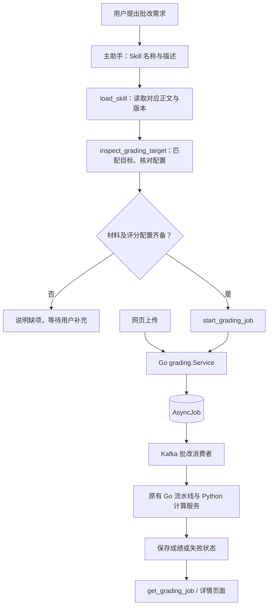

# 批改 Skill 实现与边界

作业和试卷批改各自有独立的 Skill。Skill 告诉主助手如何核对材料、处理缺项、选择工具和解释结果；执行权限、评分配置校验、任务持久化及评分计算仍由代码负责。

## 调用链

`skills/grade-homework/SKILL.md` 处理作业目标消歧、ZIP 材料、题目与 JSON 评分标准、提交和结果解释。`skills/grade-exam/SKILL.md` 处理试卷、学生、答卷页序、逐题标准及 OCR/评分失败。`fetch-homework` 仍由独立浏览器 Agent 使用，完成登录协作、导航和下载；下载后的自动批改沿用 RPA 的任务投递机制。

## 加载与执行

`internal/agent/catalog` 按 Skill 包的 runtime 元数据发现适用 Skill，主助手兼容入口位于 `internal/agent/skill_catalog.go`，校验名称、描述和正文，并对包内容计算 SHA-256 版本。目录通过 `TEACH_SKILLS_DIR` 指定，默认查找项目 `skills/`。每次聊天请求固定一份快照，初始提示只注入元数据；`load_skill` 将选中的正文返回模型。教师和管理员可加载，学生没有该入口。

`internal/agent/runtime.go` 保存原生工具调用消息，最多进行八轮模型调用。批改提交工具要求对应 Skill 已在此前一轮返回给模型，不能在同一批工具调用中一边加载、一边直接提交。业务工具的启用状态、允许角色与执行器仍由注册表和配置控制。缺少 Skill 时聊天批改不能提交，网页上传仍直接调用业务服务。

| 入口 | 职责 |
| --- | --- |
| `load_skill` | 主助手内部只读入口，返回指定 Skill 正文和版本 |
| `inspect_grading_target` | 按名称查找候选，或按 ID 核对作业/试卷配置 |
| `start_grading_job` | 根据 `kind` 提交作业 ZIP 或某学生的试卷图片 |
| `get_grading_job` | 读取当前用户新建的普通批改任务状态 |
| `trigger_async_pipeline` | 兼容原作业工具参数，转入同一服务与队列 |

提交得到任务 ID 后结束本轮工具执行，再由模型解释回执，不在聊天请求中轮询长任务。前端根据 `job_type` 区分批改与官网下载任务，普通批改显示对应作业或试卷详情链接。

## 业务服务及失败处理

`internal/grading/service.go` 被聊天和上传接口共同使用：

- 从认证上下文取得发起人及角色，不接受模型传入身份。
- 作业要求题目和非空 JSON 评分标准；试卷要求有效且唯一的题号、题目、标准答案、评分标准及正数满分。缺项返回 `needs_input`，不投递队列。
- 作业检查 ZIP 可读性、空包及越界路径；试卷检查学号、图片路径、格式和非空文件。OCR 阶段继续检查可识别内容。
- 先创建 `AsyncJob`，记录发起人；聊天任务同时记录实际加载的 Skill 名称和版本，然后发布 Kafka 消息。发布失败标记失败，不声称已经批改完成。
- 同一聊天运行中的重复调用共用幂等标识，避免重复投递；新一轮请求及网页重复上传不属于跨请求幂等范围。
- 普通新任务按发起人限制状态查询。作业和试卷资源本身继续沿用项目现有的教师/管理员共享访问模型。

试卷流水线在所有 OCR、逐题评分及汇总成功后，才在数据库事务中替换该学生的原结果。识别失败、空识别、评分 RPC 失败、非法分数及汇总失败都会让任务失败，保留之前的正常结果。现有实现仍是按页拼接全卷文本再逐题评分，题号识别属于辅助信息，尚未实现严格的答题区域切分。

作业主评分收到无效分数或保存失败时会报告失败。成绩池化仍是独立后台阶段，`SUCCESS` 表示主批改完成，不代表池化结束。详情页面可能包含历史批次，不能把页面总行数直接解释成本次批改数。

## 部署与当前限制

- 重启 Go 服务后，新工具补齐及 `AsyncJob` 新字段通过现有启动流程生效；部署须一并携带两个 Skill 文件。当前改动不需要重启 Python 浏览器 Worker。
- 网页上传自动提交批改，聊天应使用已有任务 ID 查询，不能把上传返回的路径再提交一遍。
- 历史无发起人字段的普通任务不由 `get_grading_job` 接管；官网下载及其子批改任务继续通过 `get_fetch_job` 查询。
- 普通批改使用“数据库记录后发布队列”，尚无事务 outbox；进程在两步之间退出时可能留下待处理任务，需要运维核查。RPA 原有 outbox 不受影响。
- Skill 版本记录不是完整审计系统：尚未持久化每次模型观察、工具事件与评分配置快照；聊天历史目前只存文字，重新打开历史会话不恢复任务卡片。
- 队列任务没有新增取消、恢复或跨批次隔离协议，也没有自动修改评分标准、自动发布成绩等能力。

## 验证

在 `backend-go/` 运行 `go test ./...`，重点回归在 `internal/agent/runtime_test.go`、`internal/grading/service_test.go` 和 `internal/tools/examProcess_test.go`。覆盖按需加载、同批调用顺序限制、身份限制、学生查询范围、原生工具消息、任务幂等、缺项不提交、发布失败、OCR/评分异常及成功评分。

并发评分回归可运行 `go test -race ./internal/agent ./internal/grading ./internal/tools`。前端在 `vue-grading-frontend/` 执行 `npm run build`；浏览器使用模拟 API 验证普通批改卡片、详情链接与 RPA 事件分流，不写入真实成绩。模拟测试不代表已经完成真实官网、在线模型和生产消息队列的端到端验证。
